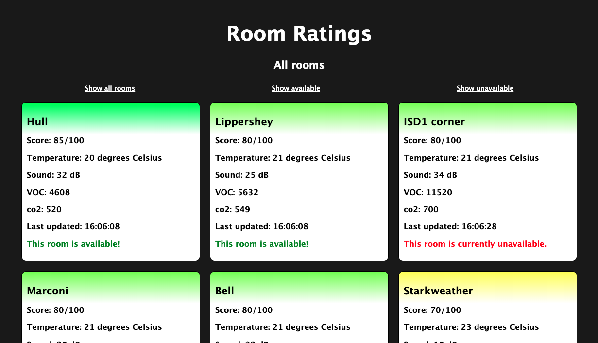

# Room Ratings

This project uses data gathered in several meeting rooms to rate those rooms based on a multitude of factors.

Every room gets a score assigned based on the following values:

- Temperature
- Sound levels
- co2
- VOC (Volatile Organic Compounds)

I decided to make 100 the perfect score, and spread the points evenly over the 4 factors:

## Temperature in degrees C, 25 points

- 20 = 25
- 19/21 = 20
- 18/22 = 15
- 17/23 = 10
- 16/24 = 5
- higher than 16/lower than 24 = 0

## Sound in dB, 25 points

- <10 = 25
- 10 - 15 = 20
- 15 - 20= 15
- 20 - 25= 10
- 25 - 35= 5
- 35> = 0

## CO2, 25 points

- <400 = 25
- 400-700 = 20
- 700-900 = 15
- 900-1000 = 10
- 1000 - 1100 = 5
- 1100> = 0

## VOC, 25 points

- <1000 = 25
- 1000-3000 = 20
- 3000-5000 = 15
- 5000-7000= 10
- 7000-10.000= 5
- 10.000> = 0

This score is reflected by a gradient (I know) over the title of the room. Green = good, red = bad.

The rooms are also ordered by score, the best one first and the worst one last.

The user can interact with the application by pressing one of the 3 buttons on top to switch between views; Either all rooms are visible, only the available rooms are visible or the unavailable rooms are visible.

The app also notifies the user whether they are online/offline because if there is no internet connection the data will not be refreshed.

The data is updated every 3 seconds if the user is online.
